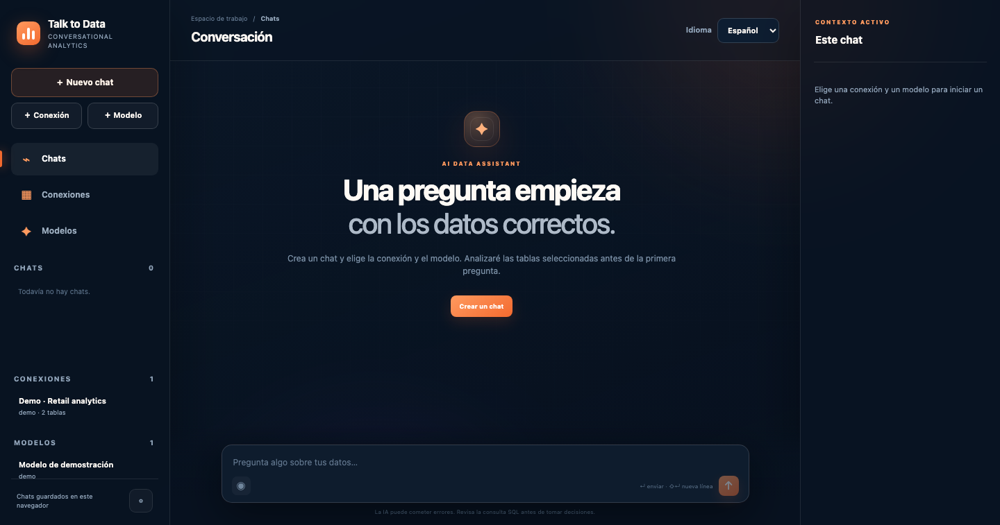
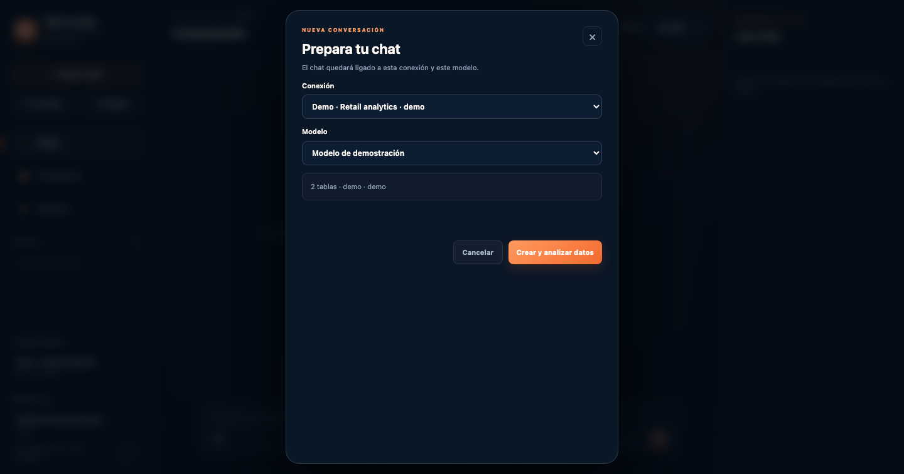
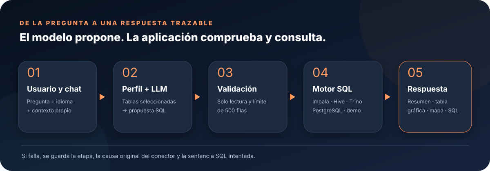
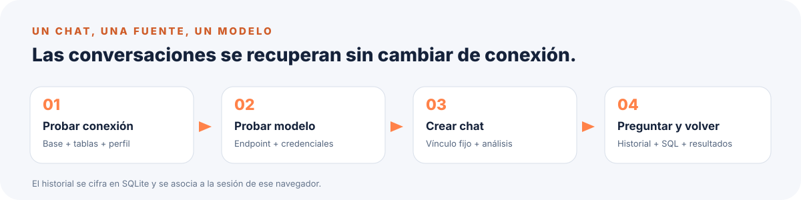
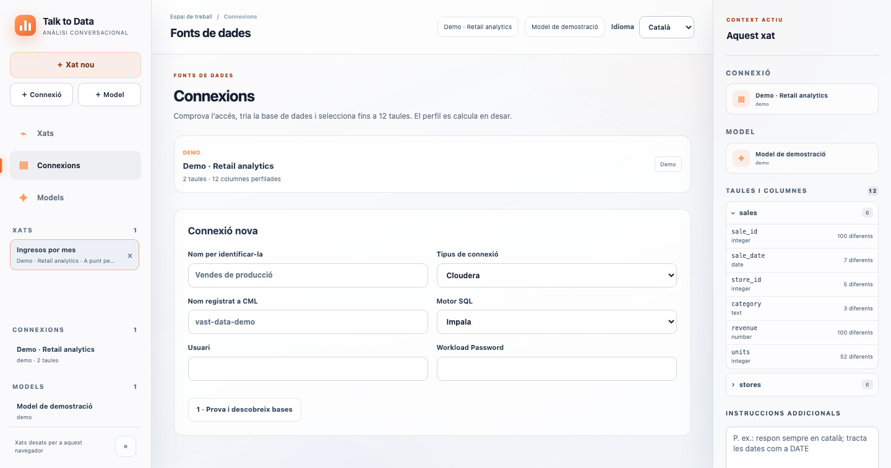
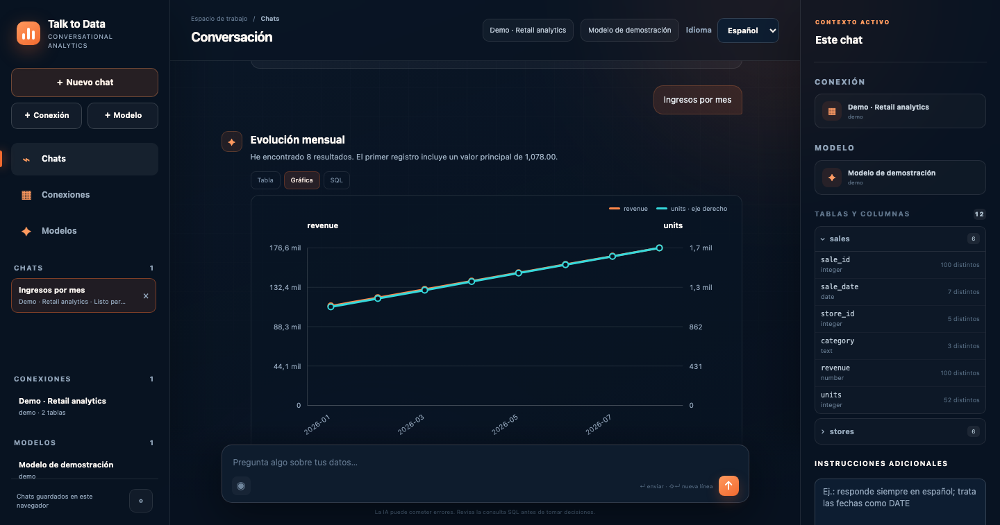
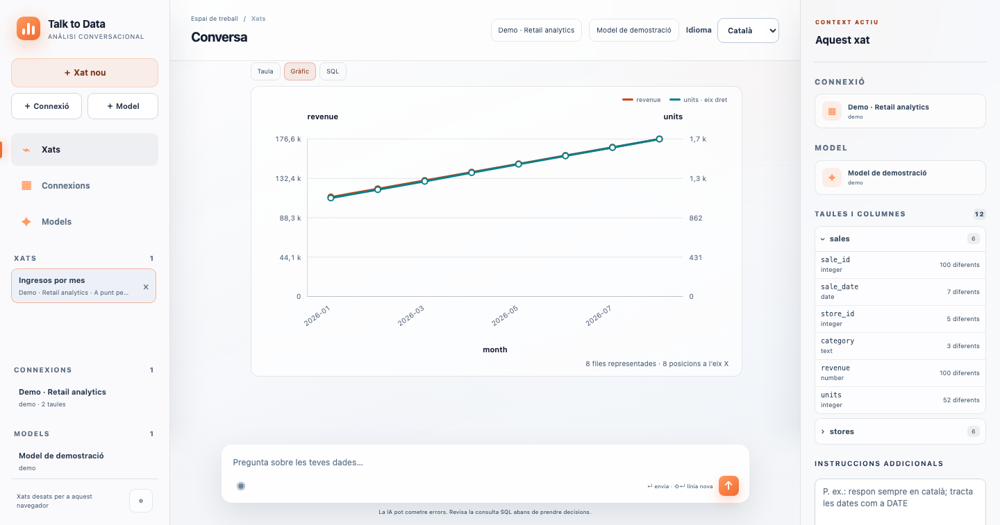

# Talk to Data

**Pregunta a tus datos en lenguaje natural y conserva siempre la consulta que produjo la respuesta.** Aplicación Flask para Cloudera Machine Learning y ejecución local: conecta una fuente SQL, selecciona tablas, prueba un modelo y empieza a conversar.



La interfaz combina historial de chats, perfiles de columnas y cinco módulos de respuesta: **resumen, tabla, gráfica, mapa y SQL copiable**. Incluye dictado por micrófono, modo claro/oscuro y ocho idiomas. Las capturas de esta guía usan solo la fuente y el modelo de demostración: no contienen credenciales ni datos privados.

> **Importante:** la IA puede equivocarse. Comprueba el SQL y los resultados antes de utilizarlos para decisiones operativas.

## Contenido

1. [Inicio rápido](#inicio-rápido)
2. [Cómo funciona](#cómo-funciona)
3. [Fuentes de datos](#fuentes-de-datos)
4. [Modelo LLM](#modelo-llm)
5. [Chats, respuestas e idiomas](#chats-respuestas-e-idiomas)
6. [Diagnóstico de errores](#diagnóstico-de-errores)
7. [Seguridad y persistencia](#seguridad-y-persistencia)
8. [Pruebas y estructura](#pruebas-y-estructura)

## Inicio rápido

El único fichero que hay que indicar como entrada de una aplicación CML es **`app.py`**. El propio Python detecta e instala mediante `pip` las dependencias ausentes antes de importar Flask; no hay que ejecutar ningún `.sh`.

En local:

```bash
git clone https://github.com/smerchanmole/chat-with-data.git
cd chat-with-data
python3 -m venv .venv
source .venv/bin/activate
export FLASK_SECRET_KEY="una-clave-larga-y-aleatoria"
python app.py
```

Abre **http://127.0.0.1:8091/** y pulsa **Nuevo chat**. La conexión `Demo · Retail analytics` y el modelo local de demostración ya están disponibles para explorar la interfaz sin servicios externos.



### Dirección y puerto

La aplicación abre **un solo listener** en `127.0.0.1`:

| Entorno | Puerto elegido |
| --- | --- |
| Cloudera CML | `CDSW_APP_PORT`; si no existe, `CDSW_READONLY_PORT` |
| Local, sin variables `CDSW_*` | `8091` |

En CML puede ejecutarse desde su motor de aplicaciones o un notebook: la resolución del directorio de recursos no depende de que exista `__file__`.

## Cómo funciona



1. **Prueba la conexión:** descubre bases, elige una y selecciona entre 1 y 12 tablas.
2. **Perfila los datos:** toma hasta 100 filas por tabla para describir columnas, tipos, valores de ejemplo y cardinalidad de la muestra.
3. **Prueba el modelo:** una petición real comprueba endpoint, credenciales y Model ID antes de guardarlo.
4. **Crea un chat:** queda ligado al identificador de esa conexión y ese modelo y empieza con un análisis preliminar.
5. **Pregunta:** el modelo recibe perfil, instrucciones y hasta seis interacciones recientes. Propone SQL de solo lectura; el servidor lo valida y limita antes de enviarlo al motor.
6. **Explora:** cambia entre tabla, gráfica, mapa (si hay coordenadas) y SQL resaltado y copiable.



## Fuentes de datos

Abre **Conexiones → Nueva conexión**. **Probar y descubrir bases** valida el acceso; después eliges base/esquema, tablas y **Guardar y analizar tablas**. Una conexión nueva no cambia los chats ya vinculados a otra.



### Cloudera: Impala o Hive

Indica el **nombre registrado en CML** (el mismo del widget de conexiones), motor **Impala** o **Hive**, usuario y **Workload Password**. No hace falta una API Key ni enumerar automáticamente las conexiones del usuario. Se usa `cml.data_v1`:

```python
import cml.data_v1 as cmldata

conn = cmldata.get_connection(
    "vast-data-demo",
    {"USERNAME": "usuario", "PASSWORD": "workload-password"},
)
try:
    databases = conn.get_pandas_dataframe("SHOW DATABASES")
finally:
    conn.close()
```

La conexión se abre para cada consulta y se cierra al terminar. El motor seleccionado determina si el prompt pide **Impala SQL** o **HiveQL**. A `SHOW`, `DESCRIBE` y `EXPLAIN` no se les añade un `LIMIT` sintácticamente inválido: las filas se limitan en la respuesta.

### PostgreSQL

Rellena URL, base inicial, usuario y contraseña. Se aceptan `postgresql://…` y `jdbc:postgresql://…`, por ejemplo `postgresql://servidor:5432?sslmode=require`. Se descubren las bases accesibles y las tablas aparecen como `esquema.tabla`.

### Trino

Pega la URL JDBC de tu virtual warehouse:

```text
jdbc:trino://virtual-warehouse.environment.dwx.company.com:443/catalog/schema
```

La app la traduce al cliente Python de Trino. Si faltan catálogo o esquema, descubre primero los catálogos y sus esquemas. Admite usuario y autenticación básica opcional.

## Modelo LLM

En **Modelos → Nuevo modelo**, pon un nombre, el endpoint y las credenciales; pulsa **Probar modelo** y, solo si responde, **Guardar modelo probado**.

| Autenticación | Cabecera enviada |
| --- | --- |
| CDP token | `Authorization: Bearer …` |
| JWT token | `Authorization: Bearer …` |
| API Key ID + Value | `X-API-Key-ID` y `X-API-Key` |

Puedes pegar la raíz del endpoint de Cloudera o la URL completa terminada en `/v1/chat/completions`. El **Model ID** es el nombre publicado por el servidor, no necesariamente el nombre del endpoint; por ejemplo `nvidia/nemotron-3-nano`. Si queda vacío, la app intenta obtenerlo de `/v1/models`. Una llamada válida tiene esta forma:

```text
POST https://…/namespaces/serving-default/endpoints/mi-endpoint/v1/chat/completions
Authorization: Bearer <CDP_TOKEN>
Content-Type: application/json

{"model":"nvidia/nemotron-3-nano","messages":[{"role":"user","content":"Hola"}]}
```

Si aparece un `404`, revisa tanto la URL como el **Model ID** anunciado por el endpoint.

## Chats, respuestas e idiomas

La lista izquierda permite cambiar de chat y consultar de nuevo **preguntas, respuestas, resultados, gráficas y SQL**. Cada conversación conserva su conexión, su modelo y sus instrucciones. Si se elimina una conexión o modelo, el historial sigue legible, pero ese chat deja de aceptar preguntas nuevas.



En **Preferencias** eliges los módulos: resumen, tabla, gráfica, mapa y SQL. Las tablas incluyen número de fila. Las gráficas usan todas las filas devueltas (hasta el límite de consulta), agrupan categoría/serie, admiten barras agrupadas o apiladas, líneas, varias series y eje secundario cuando las escalas difieren. El mapa usa Leaflet y OpenStreetMap si hay latitud y longitud; la cartografía requiere acceso a esos recursos externos.

El panel derecho muestra columnas perfiladas e instrucciones exclusivas del chat, por ejemplo «responde con puntos» o «trata `sale_date` como fecha». El micrófono utiliza el reconocimiento de voz disponible en el navegador; si no lo está, se puede escribir normalmente.

### Idiomas y apariencia

El selector de la **esquina superior derecha** cambia inmediatamente el idioma de la interfaz y de las nuevas respuestas. Están disponibles **Español, Català, Euskara, Galego, English, Français, Italiano y Deutsch**. En **Preferencias** puedes elegir por separado idioma de interfaz y respuestas, tema **claro** u **oscuro** y módulos. Las elecciones se recuerdan en el navegador; el dictado usa el idioma de la interfaz.



Los mensajes y análisis **ya generados** permanecen como se guardaron: cambiar el selector no reescribe el historial ni traduce datos, columnas, SQL o errores originales de la base. Los nuevos análisis y respuestas se solicitan en el idioma elegido.

## Diagnóstico de errores

Si una pregunta falla, la pregunta y su error quedan en el historial. La tarjeta distingue tres etapas:

| Etapa | Qué significa | Qué comprobar |
| --- | --- | --- |
| **Generación de SQL** | Falló el modelo o su respuesta JSON | Endpoint, Model ID, token, disponibilidad |
| **Validación de SQL** | La propuesta incumple reglas de solo lectura o sintaxis admitida | Pregunta, instrucciones, SQL propuesto |
| **Ejecución de SQL** | La base rechazó o no completó la consulta | Dialecto, tablas, columnas, permisos, tipos |

Junto al error aparece la **causa original del conector** —por ejemplo, un `AnalysisException` de Impala— y, si hubo SQL, la **sentencia exacta intentada**, resaltada y copiable. Así puedes reproducirla fuera de la app. Las credenciales guardadas se ocultan de las causas y del SQL mostrado.

Si Impala falla más que PostgreSQL, comprueba el motor seleccionado, la base y la tabla, y si las funciones SQL generadas existen en ese dialecto. La causa y la sentencia ayudan a separar sintaxis de permisos o conectividad.

## Seguridad y persistencia

- Se aceptan consultas de lectura (`SELECT`, `WITH`, `SHOW`, `DESCRIBE`, `EXPLAIN`); se rechazan comentarios, sentencias múltiples y operaciones de escritura o administración.
- `SELECT`/`WITH` tienen un máximo de **500 filas** en el SQL enviado al motor. Las consultas de metadatos se recortan en la respuesta para no insertarles un `LIMIT` incompatible.
- El perfilado se limita a **100 filas por tabla** y **12 tablas por conexión**.
- Chats, conexiones, modelos, perfiles, credenciales, resultados y errores se guardan cifrados en `runtime/workspace.db` con `runtime/workspace.key`.
- La cookie firmada usa `FLASK_SECRET_KEY` o una clave local persistida en `runtime/session.key`. No guarda credenciales; identifica el espacio de trabajo de ese navegador y caduca tras un año.
- **Conserva y protege `runtime/`** al actualizar o mover la app. Está excluido de Git. Sin su clave no podrán descifrarse los datos. Borrar cookies o cambiar de navegador no transfiere el historial: todavía no hay cuentas ni sincronización entre dispositivos.
- Los tokens externos pueden caducar. Para producción, establece `FLASK_SECRET_KEY` y controla acceso al proceso, archivos y red.

## Pruebas y estructura

```bash
.venv/bin/python -m unittest discover -s tests -v
node --test tests/test_charts.js tests/test_locales.js
```

Las pruebas cubren conexiones, perfilado, aislamiento de chats, cifrado, prueba de modelos, SQL de solo lectura, límites, errores con causa y SQL, gráficas e integridad de traducciones.

| Ruta | Responsabilidad |
| --- | --- |
| `app.py` | Arranque autocontenido, API Flask, sesiones y flujo pregunta → SQL → respuesta |
| `data_connector.py` | Cloudera, PostgreSQL, Trino y demo |
| `llm_client.py` | Endpoint compatible con chat/completions y autenticación |
| `workspace_store.py` | Historial cifrado y asociación fija de chat, conexión y modelo |
| `templates/index.html` | Estructura de la interfaz |
| `static/app.js`, `static/i18n.js`, `static/style.css` | Interacción, ocho idiomas, visualizaciones y estilo cristal |
| `scripts/capture_screenshots.mjs` | Capturas reproducibles de la demo (Chrome local en macOS) |

Para regenerar las capturas, inicia `python app.py` y ejecuta `node scripts/capture_screenshots.mjs` en macOS con Google Chrome instalado. El script abre un perfil temporal y usa solo la demo.
